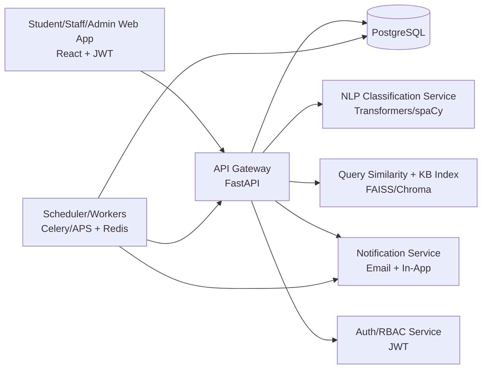

# TCF AI Complaint & Query Management System — System Architecture

## 1) Architecture Overview

The platform follows a **modular full-stack architecture** with a React frontend, FastAPI backend, PostgreSQL as the transactional database, a vector store (FAISS/Chroma) for semantic retrieval, and background workers for escalation and notifications.



## 2) Core Subsystems

### A. Frontend (React)
- Student Portal: login/signup, complaint submission, query submission, status/history, notifications.
- Staff Dashboard: assigned complaints, actions, document upload, status updates.
- Admin Dashboard: analytics, SLA monitoring, escalations, department performance.

### B. Backend API (FastAPI)
- REST API for authentication, complaints, queries, notifications, dashboards.
- Central business logic for routing, escalation, and SLA tracking.
- Role-based access control (Student, Staff, Admin, Senior Officer, Department Head).

### C. NLP Complaint Classification Agent
- Pipeline:
  1. text normalization and tokenization,
  2. keyword extraction,
  3. semantic intent classification,
  4. confidence scoring,
  5. department mapping.
- Output: predicted department + confidence + detected keywords.
- Fallback: low-confidence complaints go to Student Support Department for triage.

### D. Complaint Routing Engine
- Automatically assigns complaint to department/staff queue.
- Creates complaint history event.
- Triggers assignment notifications.

### E. SLA/Time Monitoring & Escalation
- Stage 1 SLA: response within 8 hours.
- Stage 2: unresolved after 8 hours -> escalate to Senior Officer.
- Stage 3: unresolved after 24 hours -> escalate to Department Head.
- All escalations are persisted in complaint history and analytics logs.

### F. Query Auto-Response System
- Stores incoming queries and answers.
- Uses embedding similarity against prior query logs.
- If similarity threshold is met, returns best existing answer.
- Else forwards to department and stores as unresolved query.

### G. Knowledge Base + RAG Chatbot
- Solved complaints and validated answers are indexed in vector store.
- Chatbot flow:
  1. embed user question,
  2. retrieve top-k relevant KB chunks,
  3. generate grounded response,
  4. log conversation for quality auditing.

### H. Notification System
- Email notifications (SMTP/provider).
- Dashboard notifications stored in DB.
- Triggered on complaint received/assigned/resolved/escalated.

### I. Security & Compliance
- JWT access/refresh tokens.
- Password hashing (bcrypt/argon2).
- RBAC checks on each protected endpoint.
- Structured audit logging for sensitive actions.

## 3) Runtime Architecture (Containers)

- `frontend`: React app served via Vite/Nginx.
- `backend`: FastAPI app (Uvicorn/Gunicorn).
- `postgres`: relational store.
- `redis`: queue/cache for workers.
- `worker`: background jobs (notifications/escalations/indexing).
- `vector-db` (optional service if Chroma server mode is used).

## 4) End-to-End Workflows

### Workflow 1: Complaint Intake -> Department Assignment
1. Student submits complaint.
2. API validates and stores `Submitted` complaint.
3. NLP classifies text into department.
4. Routing engine assigns complaint and status becomes `In Progress`.
5. Notifications sent to student + department staff.

### Workflow 2: SLA Escalation
1. Scheduler scans unresolved complaints.
2. If no response within 8h, complaint marked `Escalated` (level 1) to Senior Officer.
3. If still unresolved by 24h, escalated (level 2) to Department Head.
4. History and analytics updated.

### Workflow 3: Repeated Query Auto-Answer
1. Student submits query.
2. Similarity search on historical query embeddings.
3. If match above threshold: return known answer instantly.
4. Otherwise route query to department and mark pending.

### Workflow 4: Chatbot (RAG)
1. Student asks question.
2. Retriever gets relevant knowledge chunks.
3. Generator creates answer constrained by retrieved context.
4. Response + source references logged.

## 5) Proposed Project Folder Structure

```text
Agent/
├── backend/
│   ├── app/
│   │   ├── api/
│   │   │   └── v1/
│   │   │       └── endpoints/
│   │   │           ├── auth.py
│   │   │           ├── complaints.py
│   │   │           ├── queries.py
│   │   │           ├── notifications.py
│   │   │           ├── dashboard_admin.py
│   │   │           ├── dashboard_staff.py
│   │   │           └── chatbot.py
│   │   ├── core/
│   │   │   ├── config.py
│   │   │   ├── security.py
│   │   │   └── rbac.py
│   │   ├── db/
│   │   │   ├── base.py
│   │   │   ├── session.py
│   │   │   └── migrations/
│   │   ├── models/
│   │   ├── schemas/
│   │   ├── repositories/
│   │   ├── services/
│   │   │   ├── nlp/
│   │   │   ├── rag/
│   │   │   ├── routing/
│   │   │   ├── escalation/
│   │   │   └── notifications/
│   │   ├── workers/
│   │   │   ├── escalation_worker.py
│   │   │   ├── notification_worker.py
│   │   │   └── indexing_worker.py
│   │   └── main.py
│   ├── tests/
│   └── requirements.txt
├── frontend/
│   ├── src/
│   │   ├── api/
│   │   ├── components/
│   │   │   ├── common/
│   │   │   ├── complaints/
│   │   │   ├── chatbot/
│   │   │   └── dashboard/
│   │   ├── pages/
│   │   │   ├── auth/
│   │   │   ├── student/
│   │   │   ├── staff/
│   │   │   └── admin/
│   │   ├── hooks/
│   │   ├── store/
│   │   ├── styles/
│   │   └── main.jsx
│   └── package.json
├── infra/
│   ├── docker/
│   │   └── docker-compose.yml
│   └── nginx/
├── docs/
│   └── system_architecture.md
├── scripts/
├── .env.example
└── .github/
    └── workflows/
```

## 6) Suggested Next Build Step

After architecture approval, implement:
1. Database schema + migrations,
2. Auth + RBAC,
3. complaint submission/classification/routing APIs,
4. escalation worker,
5. initial React portals.
